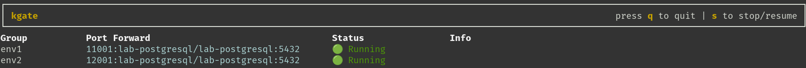

# KGate

simple CLI tool designed to manage multiple k9s port forwards.



## Table of Contents

- [Features](#features)
- [Installation & Getting Started](#installation--getting-started)
- [Usage](#usage)
  - [Display Help](#display-help)
  - [Switching Profiles](#switching-profiles)
  - [Running Specific Groups](#running-specific-groups)
- [Configuration](#configuration)
- [Build Status](#build-status)
- [Test Coverage Report](#test-coverage-report)

## Features

- **Multi-Profile Management:** switch between different profiles.
- **Port Forwarding:** manage port forwards across various environments using k8s files and contexts.
- **CLI Friendly:** run from terminal, simple commands

## Installation & Getting Started

1. **Install KGate:**  
   Ensure you have golang installed on your system and run:
   ```shell
   go install cmd/kgate/kgate.go
   ```
2. **Create a Profile:**  
   Create a new profile by running:
   ```shell
   kgate p c my-profile
   ```
3. **Configure the Profile:**  
   Open and complete profile settings:
   ```shell
   vim ~/.config/kgate/settings.yaml
   ```
4. **Run KGate:**  
   Start KGate with:
   ```shell
   kgate
   ```

## Usage

### Display Help

To view the help menu and available commands, use:
```shell
kgate --help
```

### Switching Profiles

Switch to another profile using (fuzzy search):
```shell
kgate p other-profile
```

### Running only specific Groups

Run specific groups by specifying them with the `-g` flag:
```shell
kgate -g env1 -g env2
```

## Configuration

KGate uses a YAML configuration file located at `~/.config/kgate/settings.yaml`. An example configuration is provided below:

```yaml
current: demo
profiles:
  demo:
    name: demo
    data:
      groups:
        - name: env1
          target:
            k8sConfigFile: ${HOME}/.kube/config
            k8sContext: pvt-dev1
          portForwards:
            - namespace: lab-postgresql
              service: lab-postgresql
              localPort: "11001"
              remotePort: "5432"
        - name: env2
          target:
            k8sConfigFile: ${HOME}/.kube/config
            k8sContext: pvt-dev2
          portForwards:
            - namespace: lab-postgresql
              service: lab-postgresql
              localPort: "12001"
              remotePort: "5432"
```

> **Note:** Customize the configuration to suit your Kubernetes contexts and port forwarding requirements.

## Build Status

[](https://github.com/rollicks-c/kgate/actions/workflows/go.yml)

## Test Coverage Report

For the latest test coverage details, please visit the [Test Coverage Report](https://rollicks-c.github.io/kgate/coverage.html).
